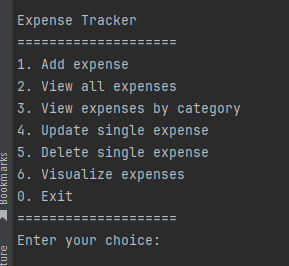
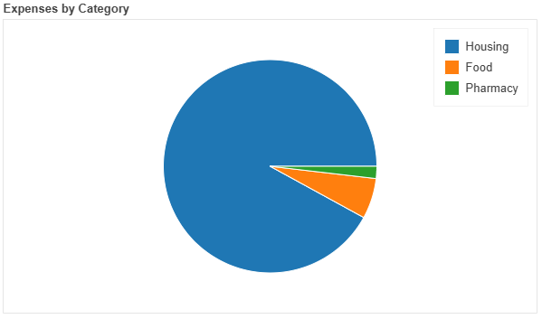
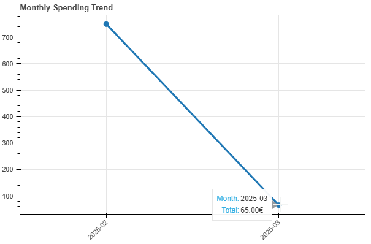

# Finance Tracker

Tool to track your expenses and graphically plot them.

> Information: The tool is still on development. Beware the usage could change in the future.

> Information: The following features are soon to be implemented:
>    - More interactive UI with Bokeh
>    - More interactive UI with PyQt
>    - Additional filtering options over the plots
>    - Allow to track incomes & display monthly income vs expenses

## 🐍 Python Setup

**Installation**

The package does not have a PyPI release, but it can still be installed via pip:
````commandline
pip install git+https://github.com/Jtachan/FinanceTracker.git
````

Alternatively, clone the repository and install it locally:
```commandline
git clone https://github.com/Jtachan/FinanceTracker.git
cd FinanceTracker
pip install .
```

Once launched, the tool will create a file "finance.db" at the current working directory.
All expenses are stored here, do not delete the file.

## Usage

### Minimal UI

The tool has a minimal UI by ussing the terminal.
The UI is accessible via the following call:

```bash
cli-finance
```

The minimal UI is defined by a menu of valid operations to perform.



The data visualization at this mode is either by selecting options 2 or 3, which will print a table over the terminal (as shown in the following images);
or by option 6, displaying graphical plots over a locally hosted HTML page.

See the section ['Plots'](#plots) for more information about the option 6.


_All expenses table_
```commandline
ID  | Date         | Amount     | Category        | Description
----------------------------------------------------------------------
1   | 2025-03-03   | 50.00    € | Food            | Food
3   | 2025-03-03   | 15.00    € | Pharmacy        | Dm
2   | 2025-02-01   | 750.00   € | Housing         | Rent for February
```

_Expenses by category table_:
```commandline
Category        Total
-------------------------
Housing         $750.00
Food            $50.00
Pharmacy        $15.00

```

## Plots

### Expenses per category



### Monthly trend


